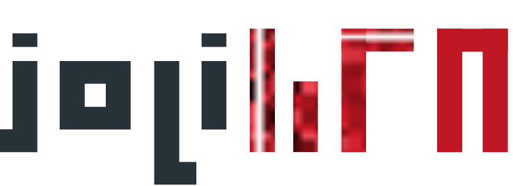

<div align="center">

</div>

<h1 align="center">Generative AI Image Toolset with GANs and Diffusion for Real-World Applications</h1>

**JoliGEN** is an integrated framework for training custom generative AI image-to-image models

Main Features:

- JoliGEN implements both **GAN and Diffusion models** for unpaired and paired image to image translation tasks, including domain and style adaptation with conservation of semantics such as image and object classes, masks, ...

- JoliGEN generative AI capabilities are targeted at real world applications such as **Controled Image Generation**, **Augmented Reality**, **Dataset Smart Augmentation** and object insertion, **Synthetic to Real** transforms.

- JoliGEN allows for fast and stable training with astonishing results. A [**server with REST API**](https://www.joligen.com/doc/server.html#running-joligen-server) is provided that allows for simplified deployment and usage.

- JoliGEN has a large scope of [options and parameters](https://www.joligen.com/doc/options.html). To not get overwhelmed, follow the simple [Quickstarts](https://www.joligen.com/doc/quickstart_ddpm.html). There are then links to more detailed documentation on models, dataset formats, and data augmentation.

### Useful links

- [JoliGEN documentation](https://www.joligen.com/doc/)
- [GAN Quickstart](https://www.joligen.com/doc/quickstart_gan.html)
- [Diffusion Quickstart](https://www.joligen.com/doc/quickstart_ddpm.html)
- [Datasets](https://www.joligen.com/doc/datasets.html)
- [Training Tips](https://www.joligen.com/doc/tips.html)

## Use cases

- **AR and metaverse**: replace any image element with super-realistic objects
- **Image manipulation**: seamlessly insert or remove objects/elements in images
- **Image to image translation while preserving semantics**, e.g. existing source dataset annotations
- **Simulation to reality** translation while preserving elements, metrics, ...
- **Image generation to enrich datasets**, e.g. counter dataset imbalance, increase test sets, ...

This is achieved by combining powerful and customized generator architectures, bags of discriminators, and configurable neural networks and losses that ensure conservation of fundamental elements between source and target images.

## Example results

### Image translation while preserving the class

Mario to Sonic while preserving the action (running, jumping, ...)


### Object insertion

Car insertion (BDD100K) with Diffusion


Glasses insertion (FFHQ) with Diffusion


### Object removal

Glasses removal with GANs


### Style transfer while preserving label boxes (e.g. cars, pedestrians, street signs, ...)

Day to night (BDD100K) with Transformers and GANs


Clear to snow (BDD100K) by applying a generator multiple times to add snow incrementally


Clear to overcast (BDD100K)


Clear to rainy (BDD100K)


## Features

- SoTA image to image translation
- Semantic consistency: conservation of labels of many types: bounding boxes, masks, classes.
- SoTA discriminator models: [projected](https://arxiv.org/abs/2111.01007), [vision_aided](https://arxiv.org/abs/2112.09130), custom transformers.
- Advanced generators: [real-time](https://github.com/jolibrain/joliGEN/blob/chore_new_readme/models/modules/resnet_architecture/resnet_generator.py#L388), [transformers](https://arxiv.org/abs/2203.16015), [hybrid transformers-CNN](https://github.com/jolibrain/joliGEN/blob/chore_new_readme/models/modules/segformer/segformer_generator.py#L95), [Attention-based](https://arxiv.org/abs/1911.11897), [UNet with attention](https://github.com/jolibrain/joliGEN/blob/chore_new_readme/models/modules/unet_generator_attn/unet_generator_attn.py#L323), [StyleGAN2](https://github.com/jolibrain/joliGEN/blob/chore_new_readme/models/modules/stylegan_networks.py)
- Multiple models based on adversarial and diffusion generation: [CycleGAN](https://arxiv.org/abs/1703.10593), [CyCADA](https://arxiv.org/abs/1711.03213), [CUT](https://arxiv.org/abs/2007.15651), [Palette](https://arxiv.org/abs/2111.05826)
- GAN data augmentation mechanisms: [APA](https://arxiv.org/abs/2111.06849), discriminator noise injection, standard image augmentation, online augmentation through sampling around bounding boxes
- Output quality metrics: FID, PSNR, KID, ...
- Server with [REST API](https://www.joligen.com/doc/API.html)
- Support for both CPU and GPU
- [Dockerized server](https://www.joligen.com/doc/docker.html)
- Production-grade deployment in C++ via [DeepDetect](https://github.com/jolibrain/deepdetect/)

---

## Code format and Contribution

If you want to contribute please use [black](https://github.com/psf/black) code format.
Install:

```
pip install black 
```

Usage :

```
black .
```

If you want to format the code automatically before every commit :

```
pip install pre-commit
pre-commit install
```

## Authors

**JoliGEN** is created and developed by [Jolibrain](https://www.jolibrain.com/).

Code structure is inspired by [pytorch-CycleGAN-and-pix2pix](https://github.com/junyanz/pytorch-CycleGAN-and-pix2pix), [CUT](https://github.com/taesungp/contrastive-unpaired-translation), [AttentionGAN](https://github.com/Ha0Tang/AttentionGAN), [MoNCE](https://github.com/fnzhan/MoNCE), [Palette](https://github.com/Janspiry/Palette-Image-to-Image-Diffusion-Models) among others.

Elements from JoliGEN are supported by the French National AI program ["Confiance.AI"](https://www.confiance.ai/en/)

Contact: <contact@jolibrain.com>
