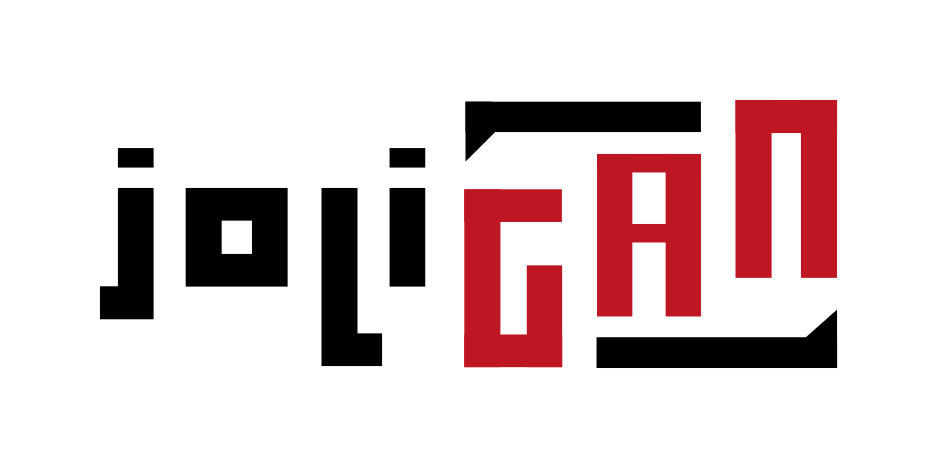

<h1 align="center">Image-to-Image Translation for Domain Adaptation</h1>

**JoliGAN** provides models and machine learning tools for unpaired image to image translation and domain adaptation.
- Multiple models based on adversarial generation: [CycleGAN](https://arxiv.org/abs/1703.10593), [CyCADA](https://arxiv.org/abs/1711.03213), [CUT](https://arxiv.org/abs/2007.15651) and more
- Many generator architectures such as styleGAN2 decoder / mobile resnet, attention resnet,...
- Semantic consistency allowing to perform domain adaptation e.g. from synthetic to real-like data

---

## Use cases

- Image to image translation while preserving semantic

<!-- _glasses 2 no glasses, explicative schemas, results_ -->

- Image to image translation to cope with scarce data

<!-- _eye gaze or another dataset, schemas, results_ -->

## Models

| Name | Paper |
| -- | -- |
| CycleGAN | https://arxiv.org/abs/1703.10593 | 
| CyCADA | https://arxiv.org/abs/1711.03213 |
| CUT | https://arxiv.org/abs/2007.15651 |
| RecycleGAN | https://arxiv.org/abs/1808.05174 |
| StyleGAN2 | https://arxiv.org/abs/1912.04958 |

## Generator architectures

| Architecture  | Number of parameters |
| -- | -- |
|Resnet 9 blocks|11.378M|
|Mobile resnet 9 blocks|1.987M|
|Resnet attn|11.823M|
|Mobile resnet attn|2.432M|
|Segformer b0|4.158M|
|Segformer attn b0|4.60M|
|Segformer attn b1|14.724M|
|Segformer attn b5|83.016M|

## Quick Start

### Prerequisites

- Linux
- Python 3
- CPU or NVIDIA GPU + CUDA CuDNN

### Installation

Clone this repo:
```bash
git clone --recursive https://github.com/jolibrain/joliGAN.git
cd joliGAN
```

Install [PyTorch](http://pytorch.org) and other dependencies (torchvision, [visdom](https://github.com/facebookresearch/visdom) and [dominate](https://github.com/Knio/dominate), [FID](https://github.com/jolibrain/pytorch-fid)).  
For pip users, please type the command `pip install -r requirements.txt`.

## JoliGAN training

With a dataset located in directory `dataroot`:

- Train a [cycleGAN](docs/cyclegan.md) :
 
You can tune the hyperparameters in `./scripts/train_cyclegan.sh` and then use the following line command.
```
bash ./scripts/train_cyclegan.sh dataroot
```
<br>

- Train a [cycleGAN with labels](docs/cyclegan_semantic.md) :
 
You can tune the hyperparameters in `./scripts/train_cyclegan_semantic.sh` and then use the following line command.
```
bash ./scripts/train_cyclegan_semantic.sh dataroot
```
<br>

- Train a [cycleGAN with mask labels](docs/cyclegan_semantic_mask.md) :
 
You can tune the hyperparameters in `./scripts/train_cyclegan_semantic_mask.sh` and then use the following line command.
```
bash ./scripts/train_cyclegan_semantic_mask.sh dataroot
```

## JoliGAN server

Ensure everything is installed
```bash
python3 -m pip install fastapi uvicorn
```

Then run server:
```bash
server/run.sh --host localhost --port 8000
```

## Tests
To launch tests before new commits:
```
bash scripts/run_tests.sh /path/to/dir
```

## Docker build
To build a docker for joliGAN server:
```
docker build -t jolibrain/joligan_build -f docker/Dockerfile.build .
docker build -t jolibrain/joligan_server -f docker/Dockerfile.server .
```
To run the joliGAN docker:
```
nvidia-docker run jolibrain/myjoligan
```

## Authors

**JoliGAN** is created and maintained by [Jolibrain](https://www.jolibrain.com/).

Our code is inspired by [pytorch-CycleGAN-and-pix2pix](https://github.com/junyanz/pytorch-CycleGAN-and-pix2pix), [CUT](https://github.com/taesungp/contrastive-unpaired-translation) and [AttentionGAN](https://github.com/Ha0Tang/AttentionGAN) among others.
