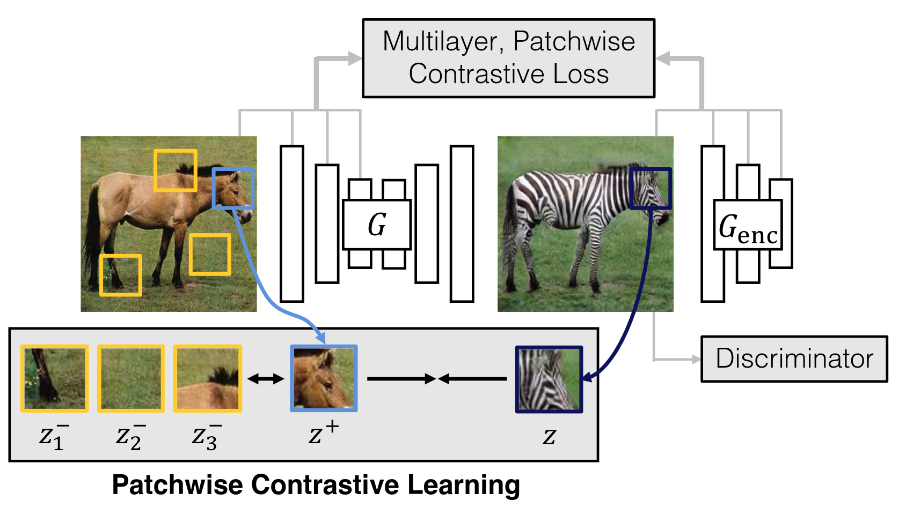

##########################################
 GANs and Diffusion Models: How to Choose
##########################################

*********************
 Image-to-Image GANs
*********************

Image-to-image Generative Adversarial Networks (GANs) are innovative
models in the domain of machine learning that have made substantial
contributions to the field of computer vision. They provide a framework
that facilitates the translation of one type of image into another,
while preserving the key structural aspects of the original image.

*Schematic representation of an image-to-image GAN architecture*, from
https://arxiv.org/abs/2007.15651

At a fundamental level, a GAN consists of two components: a generator
and a discriminator. The generator creates new data instances, while the
discriminator evaluates them for authenticity; i.e., whether each
instance of data belongs to the actual training set or was created by
the generator. The generator is trained to produce increasingly better
fakes, while the discriminator is trained to become a better judge. This
adversarial process leads to the generator creating highly authentic
data instances.

An image-to-image GAN, a specific type of GAN, operates on the same
principles. However, instead of generating data from random noise, it
transforms an input image into a corresponding output image. This
process has a broad range of applications, including but not limited to
style transfer, super-resolution, and image synthesis.

*Illustration of the process of image transformation using
image-to-image GANs*

The core functionality of image-to-image GANs hinges on 'conditional'
adversarial networks, meaning the generator is conditioned on certain
input. Here, the input is an image, and the output is another image,
which is a transformation of the input image. This transformation can be
any mapping, for instance, a grayscale image to a color image, or a
semantic label map to a photorealistic image.

Image-to-image GANs are a unique solution when dataset is unpaired, i.e.
input and output images cannot exist in reality or cannot be acquired.
There's no dataset of paired horses and zebras for instance.

.. image:: https://user-images.githubusercontent.com/3530657/200873601-e8c2d165-af58-4b39-a0bf-ecab510981c5.png

*Examples of transformation carried out by image-to-image GANs*

The utility and impact of image-to-image GANs are immense. They are
widely used in the domain of computer graphics, autonomous driving,
medical imaging, and more. From enhancing the resolution of images
(super-resolution) to transforming satellite images into maps,
image-to-image GANs hold the potential to revolutionize numerous
industries.

.. image:: https://user-images.githubusercontent.com/3530657/196472056-b342c326-056f-4680-ad8d-4bf932b1404a.png

*Examples of practical application of image-to-image GANs*

**********************************
 Image Denoising Diffusion Models
**********************************

Denoising Diffusion Probabilistic Models (DDPMs) represent a class of
generative models that provide a novel approach to synthesizing
high-quality images. Particularly in the realm of image-to-image
generation, such as inpainting and super-resolution, DDPMs exhibit
excellent performance and results.

In the arena of generative models, DDPMs have emerged as a strong
contender to the likes of GANs and Variational Autoencoders (VAEs). The
key principle behind DDPMs is the transformation of a simple noise
distribution into a complex data distribution via a diffusion process
that gradually adds or removes details over time.

*Schematic representation of the diffusion process in DDPMs*

**************************************
 Image-to-Image Generation with DDPMs
**************************************

When applied to the field of image-to-image generation, such as
inpainting (filling in missing parts of an image) and super-resolution
(enhancing the resolution of an image), DDPMs can leverage their
diffusion process to generate very high-quality results. The model
essentially learns the data distribution of images, and through the
gradual diffusion process, it can transform a noisy or incomplete image
into a clean, detailed one.

*Examples of image inpainting using DDPMs*

The significance of DDPMs in image-to-image tasks cannot be understated.
The quality of the generated images is often superior to those from
traditional GAN-based or VAE-based models. Furthermore, DDPMs have a
more stable and easier-to-train architecture, which is another reason
for their growing popularity.

Inpainting and super-resolution tasks with DDPMs can be applied in
various fields, such as digital media editing, satellite image
enhancement, and medical imaging, among others. As we move forward, the
influence and applications of these models are only set to increase.

*Example of practical application of DDPMs in image-to-image generative
task*

DDPMs allow for fine-grained control of image generation, via
conditioning. This is critical to industrial use-cases, allowing for
careful controlled generation, even outside the perimeter of the
training set.

*Fine-grained control of DDPM out-of-domain generation: meow traffic
sign*

.. _how-to-choose:

***************
 How to choose
***************

When to use GANs

-  If your application relies on an unpaired dataset: use GANs
-  If your application is style transfer while preserving certain
   elements (e.g. change weather but conserve main scene), use GANs

When to use DDPMs

-  If you have a dataset already annotated with bounding boxes or
   semantic segmentation labels, and would like to generate more objects
   within boxes or masks, use DDPMs

-  If your application requires generating elements that are not
   directly in your dataset (e.g. new traffic signs, ...), use DDPMs
   with sketch control
