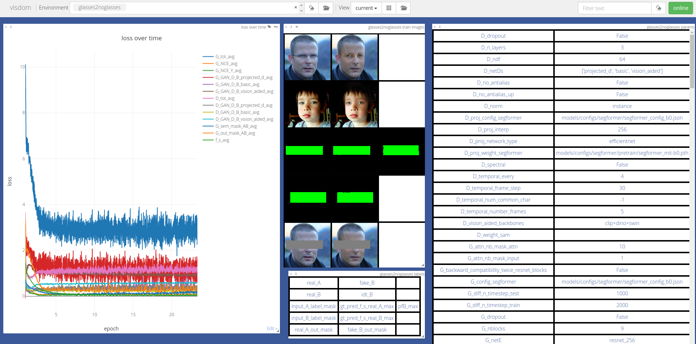

.. _losses:

##################
 JoliGEN losses
##################

******************
 GAN losses
******************

By design GAN optimize multiple networks in parallel, and thus exhibit numerous losses. These losses are trained adversarially, i.e. againts each other. A consequence is most losses do not exhibit straight increasing or decreasing behaviors. As a matter of fact, stabilized and noisy losses are a good sign that training of all networks is balanced.

Review of GAN losses in JoliGEN:

- **G_xxx**: Generator losses

  - **G_tot_avg**: average total of all Generator losses. Adversarial.
  - **G_GAN_D_B_xxx_avg**: Generator loss against Discriminator xxx on domain B, averaged. There's one per Discriminator. Adversarial.
    
  - **G_NCE_avg**: contrastive loss on Generator between domains A and B (`cut` model only). Descending.
  - **G_NCE_Y_avg**: contrastive loss on Generator on identify (B to B) (`cut` model only). Descending.

  - **G_sem_mask_AB**: supervised loss on mask conservation across domains A and B. Descending.
  - **G_out_mask_AB**: supervised conservation loss on pixels outside of masks, across domains A and B. Descending.
    
- **D_xxx**: Discriminator losses

  - **D_GAN_D_B_xxx_avg**: Discriminator xxx loss between real and fake data on domain B. There's one per Discriminator. Adversarial.

- **f_s**: losses of the supervised class or mask classifiers/segmenters. Descending.
  
******************
 DDPM losses
******************

DDPMs are trained in a supervised manner. Therefore there's most often a single descending loss to be monitored.

.. image:: _static/quickstart_visdom_palette.png

Review of DDPM losses in JoliGEN:

- **G_tot_avg**: average of the denoising network loss. Descending.
	   
.. _losses-visualize losses:

******************
 Visualize losses
******************

To display with Visdom losses from past trainings, run

.. code:: bash

   python3 util/load_display_losses.py --loss_log_file_path path_to_repo_of_loss.json --port 8097 --env_name visdom_environment_name
