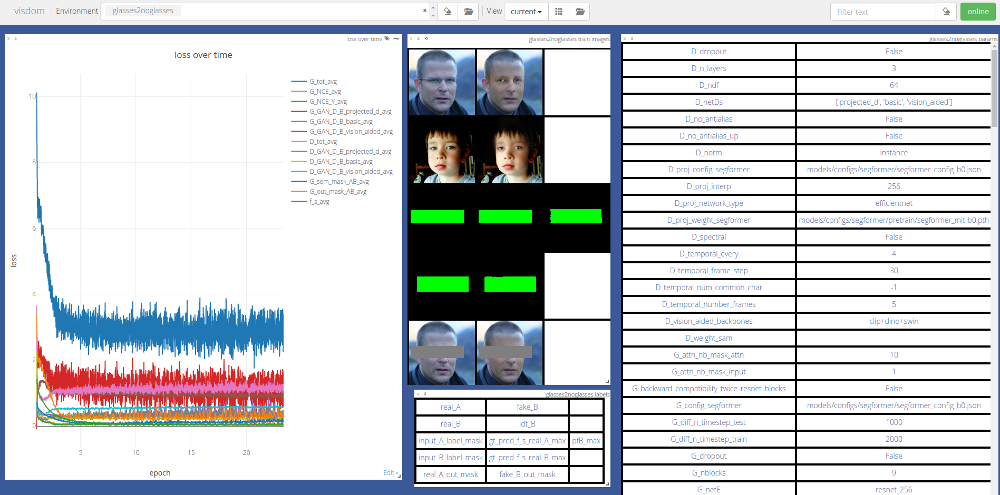
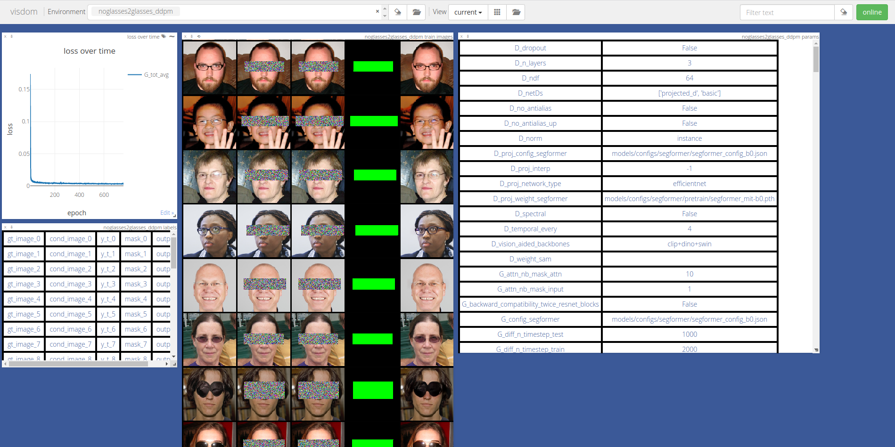

.. _quickstart:

#############
 Quick Start
#############

This page will guide you to train a GAN to remove glasses for human
faces, and a DDPM to add glasses on human faces.

.. _quickstart-install:

**************
 Installation
**************

Clone this repo:

.. code:: bash

   git clone https://github.com/jolibrain/joliGEN.git
   cd joliGEN

Install PyTorch and other dependencies (torchvision, visdom) with:

.. code:: bash

   pip install -r requirements.txt --upgrade

********************************************************
 Train a GAN for unpaired dataset and domain adaptation
********************************************************

.. _quickstart-gan-dataset:

Download the Dataset
====================

Download the dataset (3.3 Gb), unzip it, place it in the ``datasets`` directory, and create your ``checkpoints`` directory:

.. code:: bash

   wget https://www.joligen.com/datasets/noglasses2glasses_ffhq.zip
   unzip noglasses2glasses_ffhq.zip
   mkdir datasets
   mv noglasses2glasses_ffhq datasets/noglasses2glasses_ffhq
   rm noglasses2glasses_ffhq.zip
   mkdir checkpoints

Train your GAN
==============

We will train a GAN based on `CUT
<https://github.com/taesungp/contrastive-unpaired-translation>`_ to
remove glasses from human's faces.

Use ``train.py`` along with the `example CUT config file
<https://github.com/jolibrain/joliGEN/examples/example_glasses2noglasses.json>`_
to launch the training:

.. code:: bash

   python3 train.py --dataroot noglasses2glasses_ffhq --checkpoints_dir ./checkpoints --name glasses2noglasses --output_display_env glasses2noglasses --config_json examples/example_glasses2noglasses.json

You can follow your training evolution right from your terminal. Lines
like this one will be printed (according to the ``--output_print_freq``
option, which is set to 200 iterations in this example, we recommend
setting its value to at least ``train_batch_size * train_iter_size`` to
have smooth curves):

.. code::

   (epoch: 1, iters: 2800, time comput per image: 0.114, time data mini batch: 0.002)
   G_tot_avg: 6.772019 G_NCE_avg: 0.410732 G_NCE_Y_avg: 0.411012
   G_GAN_D_B_projected_d_avg: 2.265606 G_GAN_D_B_basic_avg: 0.465516
   G_GAN_D_B_vision_aided_avg: 1.158908 D_tot_avg: 1.014235
   D_GAN_D_B_projected_d_avg: 0.212351 D_GAN_D_B_basic_avg: 0.394115
   D_GAN_D_B_vision_aided_avg: 0.407769 G_sem_mask_AB_avg: 0.525168
   G_out_mask_AB_avg: 1.945949 f_s_avg: 1.039919

Alternatively, you can :ref:`monitor your training
<quickstart-visdom-gan>` through a local web page to which training logs
are sent.

.. _quickstart-visdom-gan:

Monitor GAN Training
====================

Open http://localhost:8097/env/glasses2noglasses (or alternatively
``http://<your-server-address>:8097`` to have a look at your training
logs: loss curves, model output and inputs, and the options used to
train.

***********************************************
 Train a DDPM for inpaining (object insertion)
***********************************************

.. _quickstart-ddpm-dataset:

Download the Dataset
====================

Download the dataset (3.3 Gb) and unzip it:

.. code:: bash

   wget https://www.joligen.com/datasets/noglasses2glasses_ffhq.zip
   unzip noglasses2glasses_ffhq.zip

Train your Diffusion Model
==========================

We will train a DDPM based on `Palette
<https://arxiv.org/abs/2111.05826>`_ to add glasses from human's faces.

Use ``train.py`` along with the `example Palette config file
<https://github.com/jolibrain/joliGEN/examples/example_noglasses2glasses.json>`_
to launch the training:

.. code:: bash

   python3 train.py --dataroot noglasses2glasses_ffhq --checkpoints_dir ./checkpoints/ --name noglasses2glasses --output_display_env noglasses2glasses --config_json examples/example_noglasses2glasses.json

You can follow your training evolution right from your terminal. Lines
like this one will be printed (according to the ``--output_print_freq``
option, which is set to 384 iterations in this example, we recommend
setting its value to at least ``train_batch_size * train_iter_size`` to
have smooth curves):

.. code::

   (epoch: 1, iters: 384, time comput per image: 0.019, time data mini batch: 0.002) G_tot_avg: 0.177608

Alternatively, you can :ref:`monitor your training
<quickstart-visdom-ddpm>` through a local web page to which training
logs are sent.

.. _quickstart-visdom-ddpm:

Monitor DDPM Training
=====================

Open http://localhost:8097/env/noglasses2glasses (or alternatively
``http://<your-server-address>:8097`` to have a look at your training
logs: loss curves, model output and inputs, and the options used to
train.

***********************
 More Training Options
***********************

JoliGEN allows for a wide range of models to be trained. Go to the
:ref:`training <training>` section to find and train the :ref:`model
<options-models-types>` for your needs.
