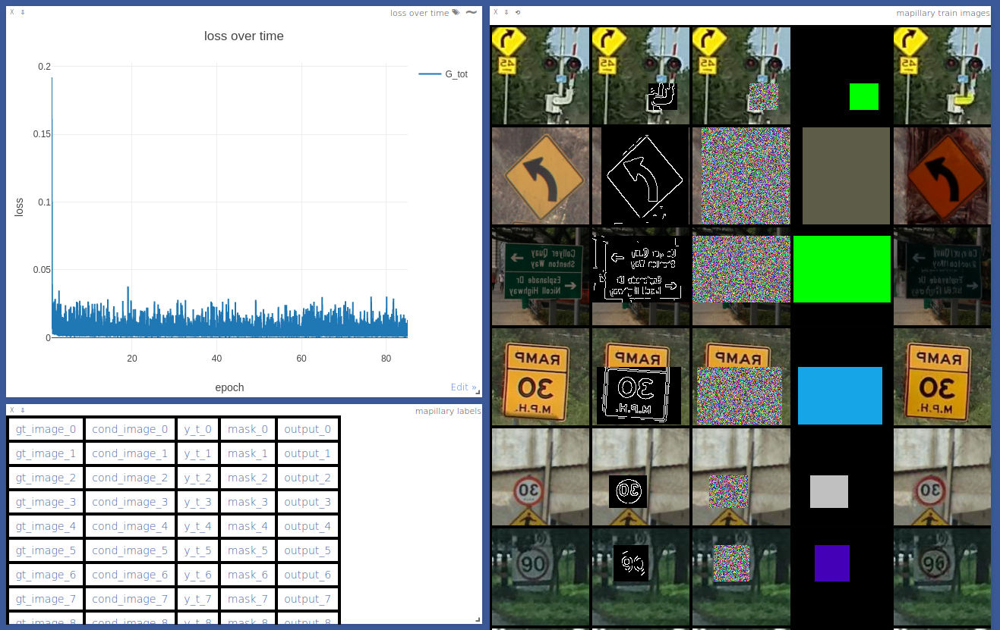
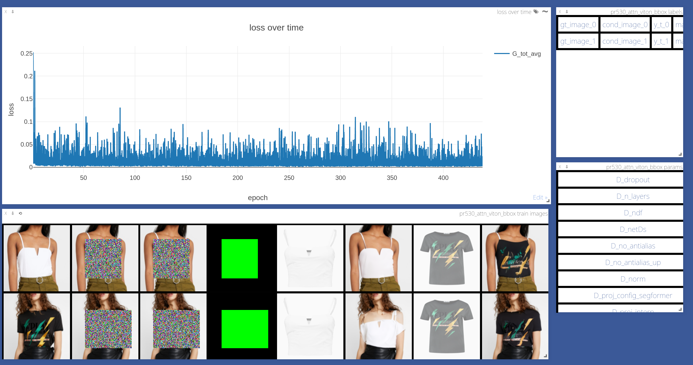

.. _training:

##################
 JoliGEN Training
##################

JoliGEN allows training custom generative models with GANs and DDPMs.

Every training run consists running `train.py` with the appropriate
set of training and data processing options.

There are three ways of passing the options to the training procedure:
- Command line
- A JSON configuration file
- REST API of the JoliGEN server

Below, the recommended manner is through a JSON configuration file,
from the `examples/` directory.

Training involves:
- One or more Generator neural networks (GANs and DDPMs)
- One or more Discriminators (GANs only)
- One or more supervised neural networks acting as constraints, e.g. on labels (GANs only)
- One or more frozen neural networks for input data processing, e.g. segmentation (GANs and DDPMs)

Training requires the following:
- one or more GPUs
- a labeled/unlabled, paired/unpaired dataset of images
- a `checkpoints` directory to be specified in which model weights are stored
- Optional: a `Visdom <https://github.com/fossasia/visdom>`_ server. Go to http://localhost:8097 to follow training losses and image result samples

JoliGEN has (too) many options, for finer grained control, see the
:doc:`full option list <options>`.

.. _training-im2im-without-semantics:

*******************************
 GAN training without semantics
*******************************

Modify as required and run with the following line command:

Dataset: https://joligen.com/datasets/horse2zebra.zip

.. code:: bash

  python3 train.py --dataroot /path/to/horse2zebra --checkpoints_dir /path/to/checkpoints --name horse2zebra --config_json examples/example_gan_horse2zebra.json

.. _training-im2im-with-class-semantics:

**********************************
 GAN training with class semantics
**********************************

Dataset: https://joligen.com/datasets/mnist2USPS.zip

.. code:: bash
	  
  python3 train.py --dataroot /path/to/mnist2USPS --checkpoints_dir /path/to/checkpoints --name mnist2USPS --config_json examples/example_gan_mnist2USPS.json

.. _training-im2im-with-mask-semantics:

*********************************
 GAN Training with mask semantics
*********************************

Dataset: https://joligen.com/datasets/noglasses2glasses_ffhq.zip

.. code:: bash

   python3 train.py --dataroot /path/to/noglasses2glasses_ffhq/ --checkpoints_dir /path/to/checkpoints/ --name noglasses2glasses --config_json examples/example_gan_noglasses2glasses.json

.. _training-im2im-with-bbox-semantics-and-online-sampling-boxes-dataaug:

************************************************
 GAN Training with online bounding box semantics
************************************************

Dataset: https://joligen.com/datasets/online_mario2sonic_full.tar

.. code:: bash

   python3 train.py --dataroot /path/to/online_mario2sonic/ --checkpoints_dir /path/to/checkpoints/ --name mario2sonic --config_json examples/example_gan_mario2sonic.json

.. _training-object-insertion:

************************************************
 DDPM training for object insertion / inpainting
************************************************

Dataset: https://joligen.com/datasets/noglasses2glasses_ffhq.zip

Trains a diffusion model to insert glasses onto faces.

.. code:: bash

   python3 train.py --dataroot /path/to/data/noglasses2glasses_ffhq --checkpoints_dir /path/to/checkpoints --name noglasses2glasses --config_json examples/example_ddpm_noglasses2glasses.json

******************************************
 DDPM training with random bbox inpainting
******************************************

Dataset: https://joligen.com/datasets/xview_inpainting_flat256_full.zip (12Gb)

Trains a diffusion model to fill up random boxes from satellite imagery

.. code:: bash

   python3 train.py --dataroot /path/to/data/xview_inpainting_flat256_full --checkpoints_dir /path/to/checkpoints --name xview_inpaint --config_json examples/example_ddpm_xview.json

.. image:: _static/xview_inpainting_train1.png
   
**************************************
 DDPM training with class conditioning
**************************************

Dataset: https://joligen.com/datasets/online_mario2sonic_lite.zip

Trains a diffusion model to generate Marios conditioned by pose (standing, walking, jumping, swimming, crouching).

.. code:: bash

   python3 train.py --dataroot /path/to/data/online_mario2sonic_full --checkpoints_dir /path/to/checkpoints --name mario --config_json examples/example_ddpm_mario.json

*********************************************
 DDPM training with Canny sketch conditioning
*********************************************

Dataset: https://joligen.com/datasets/mapillary_full.zip (85 GB)

Trains a diffusion model to generate traffic signs conditioned by a Canny sketch.

.. code:: bash

   python3 train.py --dataroot /path/to/data/mapillary_full --checkpoints_dir /path/to/checkpoints --name mapillary --config_json examples/example_ddpm_mapillary.json

Open http://localhost:8097/env/mapillary (or alternatively http://<your-server-address>:8097 to have a look at your training logs: loss curves, model output and inputs, and the options used to train.

************************************************
 DDPM training with image reference conditioning
************************************************

Dataset: https://joligen.com/datasets/viton_bbox_ref_mini.zip

Trains a diffusion model to generate tried on clothing items conditioned by a reference image.

.. code:: bash

   python3 train.py --dataroot /path/to/data/viton_bbox_ref_mini --checkpoints_dir /path/to/checkpoints --name viton --config_json examples/example_ddpm_unetref_viton.json

Open http://localhost:8097/env/viton to have a look at the training output: loss curves, model output and inputs, and the options used to train.

********************************
 DDPM training for pix2pix task
********************************

Can be used for style transfer or paired super-resolution.

Dataset: https://joligen.com/datasets/SEN2VEN_mini.zip

Trains a diffusion model to generate an image conditioned by another image (super-resolution in this example).

.. code:: bash

   python3 train.py --dataroot /path/to/data/SEN2VEN_mini --checkpoints_dir /path/to/checkpoints --name SEN2VEN --config_json examples/example_ddpm_SEN2VEN.json

*************************************************************
 Consistency Model training for object insertion / inpainting
*************************************************************

Dataset: https://joligen.com/datasets/noglasses2glasses_ffhq.zip

Trains a consistency model to insert glasses onto faces.

.. code:: bash

   python3 train.py --dataroot /path/to/data/noglasses2glasses_ffhq --checkpoints_dir /path/to/checkpoints --name noglasses2glasses --config_json examples/example_cm_noglasses2glasses.json
