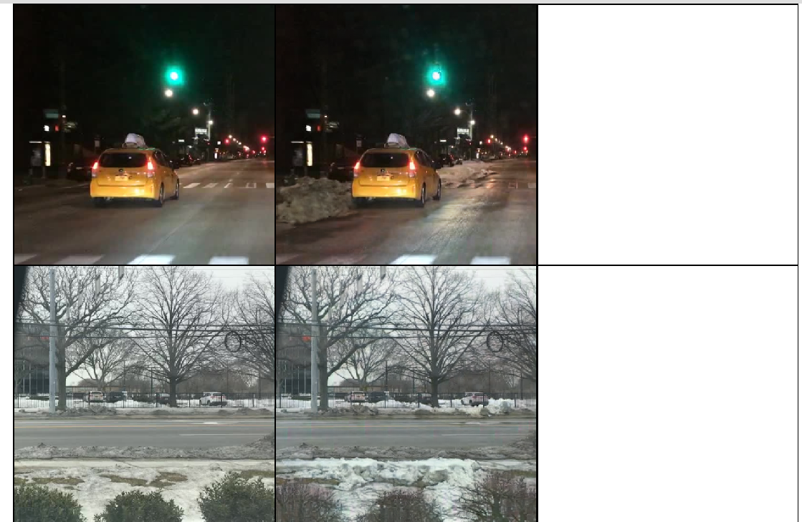
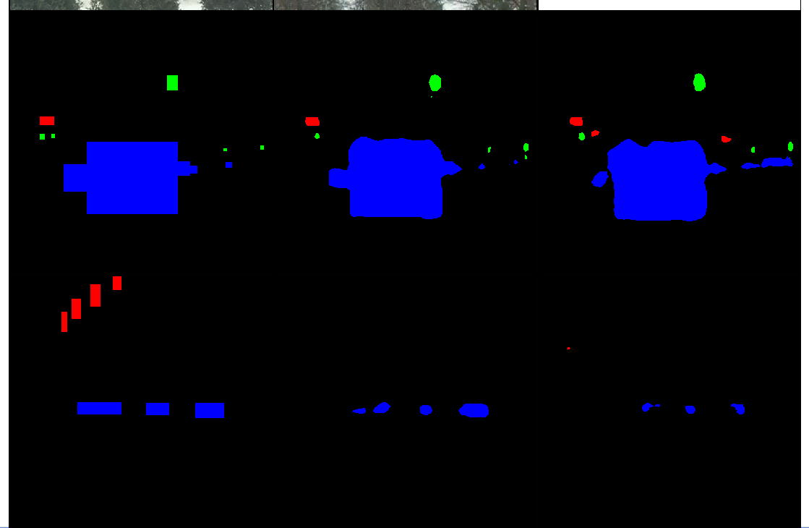
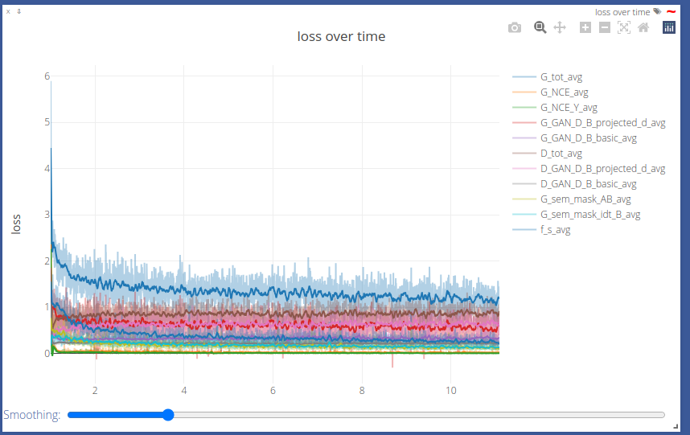
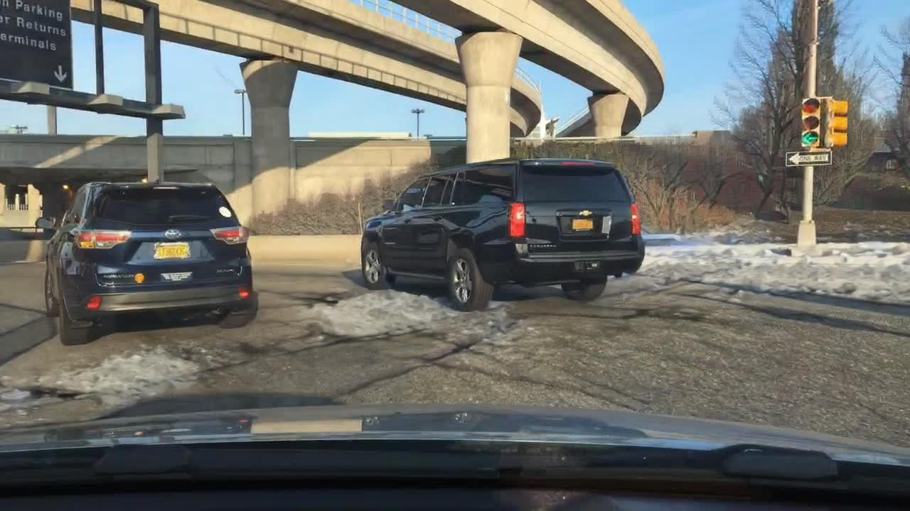
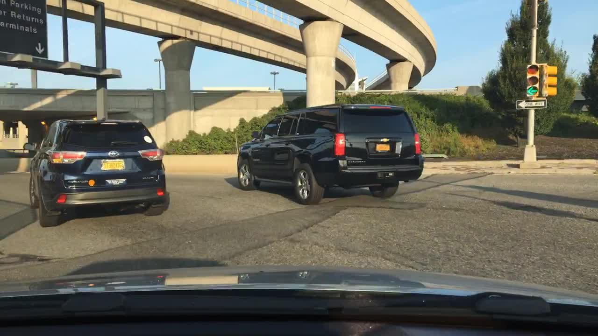
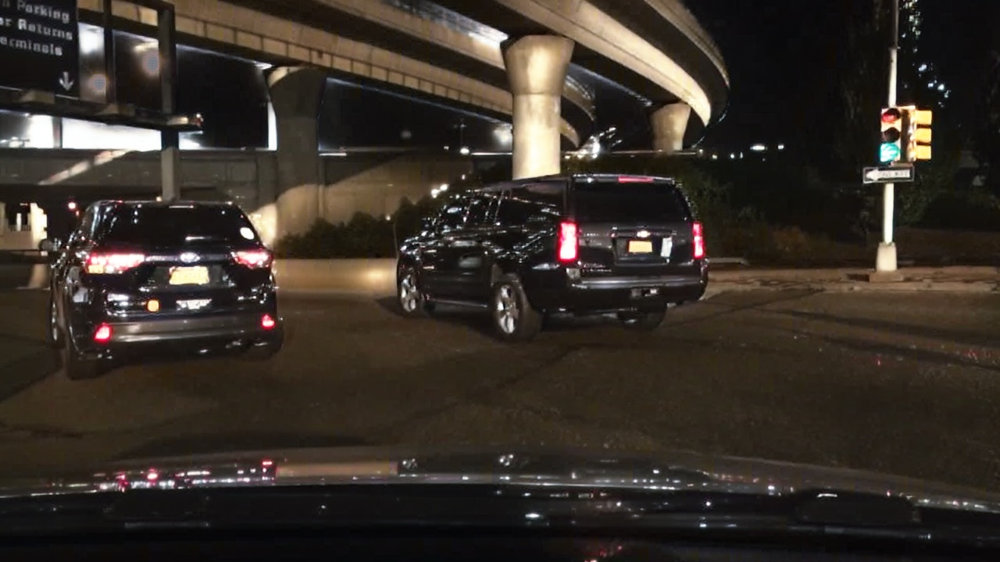

####################################
 Style transfer on BDD100K
####################################

*****************
 Install joliGEN
*****************

.. code:: bash

   cd
   git clone https://github.com/jolibrain/joliGEN.git
   cd joliGEN
   pip install -r requirements.txt --upgrade

More details: :doc:`install`.

***************************************
 Prepare the dataset to joliGEN format
***************************************

Go to `BDD100K <https://doc.bdd100k.com/download.html>`_ and download the images and labels.
Then use the following script to generate the `paths.txt` files and their
corresponding bounding box (bbox) text files.

.. code:: bash

    #!/bin/sh

    PATH_TO_JSON_LABELFILE=.../bdd100k/labels/bdd100k_labels_images_val.json
    PATH_TO_IMAGES_DIRECTORY=.../bdd100k/images/100k/val/
    PATH_TO_OUTPUT_BBOX_DIRECTORY=./val-bboxes/

    python3 ~/joliGEN/scripts/bdd100k_to_joligen.py\
        --json-label-file $PATH_TO_JSON_LABELFILE\
        --path-to-imgs $PATH_TO_IMAGES_DIRECTORY\
        --bbox-out-dir $PATH_TO_OUTPUT_BBOX_DIRECTORY\
        --weather

    mkdir -p clear2snowy
    mkdir -p clear2snowy/trainA
    mkdir -p clear2snowy/trainB

    mv bdd100k_clear.txt clear2snowy/trainA/paths.txt
    mv bdd100k_snowy.txt clear2snowy/trainB/paths.txt

    mkdir -p other_segments
    mv bdd100k_*.txt other_segments/

The preprocessed dataset is expected to contain two files: ``trainA/paths.txt``
and ``trainB/paths.txt``. ``trainA/paths.txt`` will contain a list of image paths for
all the clear images from BDD100K, while ``trainB/paths.txt`` will contain a list of
image paths for all the snowy images from BDD100K.

Each line of these files contains a tuple ``(image_path, bbox_path)`` separated by a space.

For further information about the expected formats accepted by joliGEN, please refer to
the :doc:`datasets` documentation.

*********************************
 Train the GAN Model & Arguments
*********************************

.. code:: bash

    cd ~/joliGEN
    python3 train.py\
        --D_netDs projected_d basic\
        --D_proj_interp 532\
        --D_proj_network_type dinov2_vitb14\
        --G_nblocks 9\
        --G_netG mobile_resnet_attn\
        --G_ngf 128\
        --G_padding_type reflect\
        --alg_cut_nce_idt\
        --checkpoints_dir /PATH/TO/checkpoints/\
        --data_crop_size 512\
        --data_dataset_mode unaligned_labeled_mask_online\
        --data_load_size 512\
        --data_online_creation_crop_delta_A 64\
        --data_online_creation_crop_delta_B 64\
        --data_online_creation_crop_size_A 512\
        --data_online_creation_crop_size_B 512\
        --data_relative_paths\
        --dataaug_no_rotate\
        --dataroot /PATH/TO/bdd100k_weather_clear2snowy/\
        --ddp_port 13458\
        --f_s_config_segformer models/configs/segformer/segformer_config_b1.json\
        --f_s_net segformer\
        --f_s_semantic_nclasses 19\
        --gpu 0,1\
        --model_input_nc 3\
        --model_output_nc 3\
        --model_type cut\
        --name bdd100k_clear2snowy_512\
        --output_display_freq 100\
        --output_print_freq 100\
        --train_D_lr 0.0001\
        --train_G_ema\
        --train_G_lr 0.0002\
        --train_batch_size 1\
        --train_iter_size 8\
        --train_mask_f_s_B\
        --train_n_epochs 800\
        --train_optim adamw\
        --train_sem_idt\
        --train_sem_use_label_B\
        --train_semantic_mask\
        --with_amp\
        --with_tf32\
        --with_torch_compile

This training takes about 10 hours on two A5000 GPUs, with each GPU requiring about
18GB of VRAM. You can train for longer to get even better results.

===============
 Training type
===============

We're training a GAN with the `CUT <https://arxiv.org/abs/2007.15651>`_ algorithm.

* ``--model_type cut``: Select the overall training approach to be the CUT method.
  Automatically sets the training as a GAN image translation task.
* ``--alg_cut_nce_idt``: Use the NCE loss for identity task (B -> B).
* ``--train_semantic_mask``: Add a semantic loss as a regularization loss.
  The generator is pushed to generate images that produce the same semantic segmentation mask as the input image (A -> B, with segmentation mask from A).
  This option also automatically enable the training of a segmenter on the domain A segmentation masks.
* ``--train_sem_use_label_B``: Specify that domain B has also a semantic mask label that can be used.
* ``--train_mask_f_s_B``: Train the segmenter on domain B as well.
* ``--train_sem_idt``: Apply the same regularization loss on the identity task (B -> B).
* ``--f_s_semantic_nclasses 19``: Number of classes for the segmentation task.
* ``--D_netDs projected_d basic``: The multiple types of discriminators to use for the losses.
  ``projected_d`` is a discriminator that uses a projector to project the input image to a latent space.
  ``basic`` is a simple CNN that serves as a PatchGAN discriminator.
* ``--D_proj_interp 532``: The input to the projector discriminator is upscaled to this size before being projected.
  The image is upscaled using bilinear interpolation. This is useful to control the size of the latent space.

The ``basic`` discriminator is used to better accommodate the translation at the pixel level.
On the other hand, the ``projected_d`` discriminator is used to push the generator to produce images that are close to the real image in the latent space.

To sum up:

* We're training a GAN with the CUT algorithm.
* An additional semantic loss is used to regularize the generator.
* Two discriminators are used and their losses are combined.
* The segmenter is trained on both domains.

===============
 Model options
===============

* ``--model_input_nc 3`` and ``--model_output_nc 3``: Number of input and output channels.
* ``--G_netG mobile_resnet_attn``: Define the overall generator architecture.
* ``--G_ngf 128``: Number of generator filters of the last conv layer, define the overall width of the generator.
* ``--G_nblocks 9``: Number of layers in the resnet, define the overall depth of the generator.
* ``--G_padding_type reflect``: Type of padding in the CNN layers of the generator.
* ``--D_proj_network_type dinov2_vitb14``: Define the architecture of ``projected_d`` model as the `DINOv2 <https://arxiv.org/abs/2304.07193>`_.
* ``--f_s_net segformer``: Choose the segmentation model to use as the `segformer <https://arxiv.org/abs/2105.15203>`_.
* ``--f_s_config_segformer models/configs/segformer/segformer_config_b1.json``: Points to the architecture of the segformer for segmentation.

===========================
 Dataset selection options
===========================

* ``--dataroot /PATH/TO/bdd100k_weather_clear2snowy/``: Root directory of the main dataset.
* ``--data_relative_paths``: Tells that paths in ``paths.txt`` files are relative to the dataroot directory.
* ``--data_dataset_mode unaligned_labeled_mask_online``: Specify that our dataset has a mask component and should be loaded along with the mask labels.

Also, note that the segmentation masks comes directly from the bboxes (not a real segmentation mask!).

====================================
 Online data transformation options
====================================

* ``--data_online_creation_crop_size_A 512``: Domain A images (clear images) are randomly cropped to this size. The crops are centered around a randomly choosen bbox.
* ``--data_online_creation_crop_delta_A 64``: Domain A cropped images are cropped to a random size uniformly drawn from :math:`[512 - 64; 512 + 64]`.
* ``--data_online_creation_crop_size_B 512``: Same as above for domain B images (snowy images).
* ``--data_online_creation_crop_delta_B 64``: Same as above for domain B images.
* ``--data_load_size 512``: Every cropped images are resized to this size.
* ``--data_crop_size 512``: Finally, random crops of this size are made.
* ``--dataaug_no_rotate``: Do not apply random rotations of the images in the augmentation pipeline.

The ``data_online_creation`` options are used to generate many different data points from the same input image.
This provides an augmented dataset that we further augment with more random crops.
Moreover, we removed the rotations from the data augmentations, but there remains random horizontal flips (can be turned off with ``--dataaug_no_flip``).

===========================
 Training dynamics options
===========================

* ``--train_G_lr 0.0002``: Learning rate of the generator.
* ``--train_D_lr 0.0001``: Learning rate of the discriminator.
* ``--train_batch_size 1``: Batch size used for model inference (limited by GPU memory size).
* ``--train_iter_size 8``: Number of minibatchs to accumulate before performing a backward pass (simulate a bigger effective batch size).
* ``--gpu 0,1``: Use two GPUs for training. The model is duplicated and the effective batch size is doubled.
* ``--train_n_epochs 800``: Number of epochs.
* ``--train_optim adamw``: Use `AdamW <https://pytorch.org/docs/stable/generated/torch.optim.AdamW.html>`_ as the optimizer class for all models.
* ``--train_G_ema``: The generator is trained using exponential moving averages of its weights.
  This is a common trick to improve the quality of the generated images and stabilize the training.

The final effective batch size is :math:`\text{train_batch_size} \times \text{train_iter_size} \times \text{number_gpu}`.

==================================================
 Training visualization and checkpointing options
==================================================

* ``--checkpoints_dir /PATH/TO/checkpoints/``: Path to the checkpoint directory, where the experiment will be saved.
* ``--name bdd100k_clear2snowy_512``: Experiment name, used on visdom and as the name of the directory's checkpoint experiment.
* ``--output_display_freq 100``: The number of iterations to wait before computing some images to visualize and displaying them on visdom.
* ``--output_print_freq 100``: The number of iterations to wait before printing some metrics on the console.

===============================
 Training optimization options
===============================

Some options are there just to speed up the training:

* ``--with_amp``: Automatic mixed precision to speed up some GPU computations by using 16 bits precision when possible.
* ``--with_tf32``: Accelerate 32 bits computations on Ampere GPUs by using TensorFloat32 (TF32) precision.
* ``--with_torch_compile``: Compile the model for faster execution.
* ``--ddp_port 13458``: The port to use for distributed training. Must be available.

************************
 Training Visualization
************************

Open your `local visdom website <http://localhost:8097/>`_ to monitor your training.
From here you can follow the multiple losses and some images to visualize the current model state.

===================================
 Generator inference visualization
===================================

The columns contain in this order:

* The input image to the generator.
* The transformed image by the generator.

The rows are:

* Domain A images.
* Domain B images.

The images from domain A should be transformed to be more snowy.
Domain B images should be left unchanged by the generator (identity mapping).

===================================
 Segmenter inference visualization
===================================

The columns:

* Ground truth segmentation of the input image (same input image as previous section).
* Predicted segmentation map of the input image.
* Predicted segmentation map of the generated input image.

The rows are:

* Domain A images.
* Domain B images.

Both predicted segmentation map should be similar.

===============================
 Training curves visualization
===============================

* ``G_NCE_avg``: Measure the ability of the generator to translate images from *domain A*.
* ``G_NCE_Y_avg``: Measure the ability of the generator to translate images from *domain B*.
* ``G_GAN_D_B_projected_d_avg``: Measure the ability of the generator to fool the discriminator ``projected_d``.
* ``G_GAN_D_B_basic_avg``: Measure the ability of the generator to fool the discriminator ``basic``.
* ``G_sem_mask_AB``: Measure the ability of the generator to produce images that produce the same segmentation mask as the input image when transforming from domain A to B.
* ``G_sem_mask_idt_B``: Measure the ability of the generator to produce images that produce the same segmentation mask as the input image when transforming from domain B to B.
* ``G_tot_avg``: Sum of all generator losses.
* ``D_GAN_D_B_projected_d_avg``: Measure the ability of the discriminator ``projected_d`` to distinguish between real and fake images from domain B.
* ``D_GAN_D_B_basic_avg``: Measure the ability of the discriminator ``basic`` to distinguish between real and fake images from domain B.
* ``D_tot_avg``: Sum of all discriminator losses.
* ``f_s_avg``: Segmentation loss.

You can interact with the plot to hide some of the curves.
You can also smooth the curves (see `line smoothing <https://github.com/fossasia/visdom#visline>`_).

See :doc:`losses` to read more information about the losses.

***********
 Inference
***********

=============================
Download our trained model
=============================

You can use your trained model or use our to compare.
You can download our trained model weights here:

.. code:: bash

   wget https://www.joligen.com/models/clear2snowy_bdd100k.zip
   unzip clear2snowy_bdd100k.zip -d checkpoints
   rm clear2snowy_bdd100k.zip

=========================
 Single image generation
=========================

The following script will produce a transformed image using the lastest saved model from the checkpoint directory:

.. code:: bash

   cd ~/joliGEN/scripts
   python3 gen_single_image.py\
        --model-in-file PATH/TO/checkpoints/bdd100k_clear2snowy_512/latest_net_G_A.pth\
        --img-in /PATH/TO/YOUR/IMAGE.jpg\
        --img-out output.png\
        --img-width 1280\
        --img-height 720

.. figure:: _static/tutorial_bdd100k_inference-input.jpg

    This is the input image to the generator (`train/0000f77c-6257be58.jpg`).

    This is the result of the inference. The image is transformed to be more snowy.

More details: :doc:`inference`

*****************************
 Style transfer day to night
*****************************

As another example of style transfer using joliGEN, we are going to do a similar task
but with a model that transfers day images to night images. We will be using the same
dataset BDD100K.

=======================================
 Prepare the dataset
=======================================

From the already downloaded dataset (see previous section):

.. code:: bash

    #!/bin/sh

    PATH_TO_JSON_LABELFILE=.../bdd100k/labels/bdd100k_labels_images_val.json
    PATH_TO_IMAGES_DIRECTORY=.../bdd100k/images/100k/val/
    PATH_TO_OUTPUT_BBOX_DIRECTORY=./val-bboxes/

    python3 ~/joliGEN/scripts/bdd100k_to_joligen.py\
        --json-label-file $PATH_TO_JSON_LABELFILE\
        --path-to-imgs $PATH_TO_IMAGES_DIRECTORY\
        --bbox-out-dir $PATH_TO_OUTPUT_BBOX_DIRECTORY\
        --time-of-day

    mkdir -p day2night
    mkdir -p day2night/trainA
    mkdir -p day2night/trainB

    mv bdd100k_daytime.txt day2night/trainA/paths.txt
    mv bdd100k_night.txt day2night/trainB/paths.txt

    mkdir -p other_segments
    mv bdd100k_*.txt other_segments/

This produces a similar dataset as the previous one where `trainA` contains
the paths to the day images and `trainB` contains the paths to the night images.

====================
 Training arguments
====================

.. code:: bash

    python3 train.py\
        --D_netDs projected_d basic\
        --D_proj_interp 532\
        --D_proj_network_type dinov2_vitb14\
        --G_nblocks 9\
        --G_netG mobile_resnet_attn\
        --G_ngf 128\
        --G_padding_type reflect\
        --alg_cut_nce_idt\
        --checkpoints_dir /PATH/TO/checkpoints/\
        --data_crop_size 512\
        --data_dataset_mode unaligned_labeled_mask_online\
        --data_load_size 512\
        --data_online_creation_crop_delta_A 64\
        --data_online_creation_crop_delta_B 64\
        --data_online_creation_crop_size_A 512\
        --data_online_creation_crop_size_B 512\
        --data_relative_paths\
        --dataaug_no_rotate\
        --dataroot /PATH/TO/day2night/\
        --ddp_port 13458\
        --f_s_config_segformer models/configs/segformer/segformer_config_b1.json\
        --f_s_net segformer\
        --f_s_semantic_nclasses 19\
        --gpu 0,1\
        --model_input_nc 3\
        --model_output_nc 3\
        --model_type cut\
        --name bdd100k_day2night_512\
        --output_display_freq 100\
        --output_print_freq 100\
        --train_D_lr 0.0001\
        --train_G_ema\
        --train_G_lr 0.0002\
        --train_batch_size 1\
        --train_iter_size 8\
        --train_mask_f_s_B\
        --train_n_epochs 800\
        --train_optim adamw\
        --train_sem_idt\
        --train_sem_mask_lambda 10.0\
        --train_sem_use_label_B\
        --train_semantic_mask\
        --with_amp\
        --with_tf32\
        --with_torch_compile

The only difference here is that we use the `--train_sem_mask_lambda` flag.

This flag is used to modify the default weighting of the semantic loss (1 by default).
Since the transformation day to night is lossy, the model can easily produce
an image where part of the image darker to a point that the object simply disappear.
Adapting the weight of the semantic loss is important to force the model to produce an
image that keeps every labeled objects from the input image.

=========
 Results
=========

The rest of the tutorial is similar, and you can use the same inference script.

Here is a sample of what the final model is able to do:

    This is the input image to the generator.

    This is the result of the inference. The image is transformed to be more like a night image.
