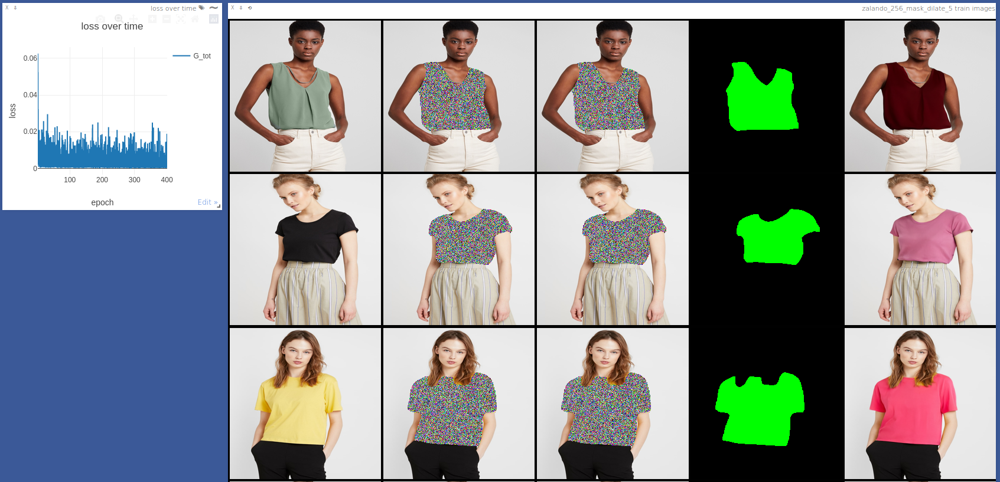
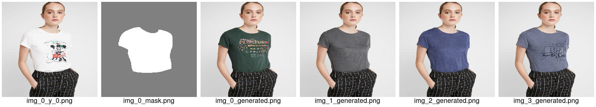

####################################
 DDPM model on the VITON-HD dataset
####################################

*****************
 Install joliGEN
*****************

.. code:: bash

   cd
   git clone https://github.com/jolibrain/joliGEN.git
   cd joliGEN
   pip install -r requirements.txt --upgrade

More details: :doc:`install`

*********************
 Prepare the Dataset
*********************

Preprocess the dataset provided by `VITON-HD
<https://github.com/shadow2496/VITON-HD#dataset>`_ (4.4 Gb) to a joliGEN
compatible format:

.. code:: bash

   cd
   wget --continue https://www.dropbox.com/s/10bfat0kg4si1bu/zalando-hd-resized.zip
   python3 ~/joliGEN/scripts/preprocess_viton.py --zip-file zalando-hd-resized.zip --target-dir ~/datasets/VITON-HD/ --dilate 5

This will produce two folders ``trainA`` and ``testA`` under the
``~/VITON-HD/datasets`` folder.

Each of these folder contains:

-  ``imgs``: the original images
-  ``mask``: the masks for the top clothes area (orange part of the
   VITON-HD segmentation)
-  ``paths.txt``: the pairs image/mask used for training/testing

****************************
 Train your Diffusion Model
****************************

.. code:: bash

   cd ~/joliGEN
   python3 train.py \
        --dataroot ~/datasets/VITON-HD/ \
        --checkpoints_dir ~/checkpoints/ \
        --name VITON-HD \
        --gpu_ids 0 \
        --model_type palette \
        --train_batch_size 8 \
        --data_num_threads 16 \
        --train_iter_size 1 \
        --model_input_nc 3 \
        --model_output_nc 3 \
        --data_relative_paths \
        --train_G_ema \
        --train_optim adamw \
        --data_dataset_mode self_supervised_labeled_mask \
        --data_load_size 256 \
        --data_crop_size 256 \
        --G_netG unet_mha \
        --data_online_creation_rand_mask_A \
        --train_G_lr 0.0001 \
        --train_n_epochs 100 \
        --dataaug_no_rotate \
        --dataaug_no_flip \
        --output_display_freq 20000 \
        --output_print_freq 500 \
        --output_display_visdom_autostart

-  If you have multiple GPUs, you can use them by adjusting the
   ``--gpu_ids`` option.
-  If you run out of memory, you should lower the ``--train_batch_size``
   option.

************************
 Training Visualization
************************

Open http://localhost:8097/env/VITON-HD to monitor your training.

The columns contain in this order:

-  original image
-  conditioning image (unused in this experience)
-  initial noise
-  mask
-  generated image

More details: :doc:`quickstart_ddpm`

***********
 Inference
***********

.. code:: bash

   mkdir -p ~/inferences
   cd ~/joliGEN/scripts
   python3 gen_single_image_diffusion.py \
        --model-in-file ~/checkpoints/VITON-HD/latest_net_G_A.pth \
        --img-in ~/datasets/VITON-HD/testA/imgs/00006_00.jpg \
        --mask-in ~/datasets/VITON-HD/testA/mask/00006_00.png \
        --dir-out ~/inferences \
        --nb_samples 4 \
        --img-width 256 \
        --img-height 256

This will produce 4 samples in the ``~/inferences`` folder.

In the example below, original image and mask followed by 4 generated
images:

More details: :doc:`inference`
